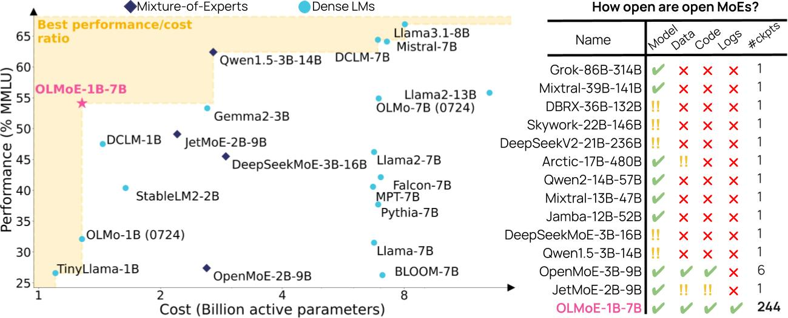

<div align="center">
  
  <h1>OLMoE: Open Mixture-of-Experts Language Models</h1>
  <p>Fully open, state-of-the-art Mixture of Expert model with 1.3 billion active and 6.9 billion total parameters. All data, code, and logs released. </p>
</div>
<br>



This repository provides an overview of all resources for the paper ["OLMoE: Open Mixture-of-Experts Language Models"](https://arxiv.org/abs/2409.02060).

- [Artifacts](#artifacts)
- [Inference](#inference)
- [Pretraining](#pretraining)
- [Adaptation](#adaptation)
- [Evaluation](#evaluation)
    - [During pretraining](#during-pretraining)
    - [After pretraining](#after-pretraining)
    - [After adaptation](#after-adaptation)
- [Visuals](#visuals)
- [Citation](#citation)

### Artifacts

- **Paper**: https://arxiv.org/abs/2409.02060
- **Pretraining** [Checkpoints](https://hf.co/allenai/OLMoE-1B-7B-0924), [Final Checkpoint GGUF](https://hf.co/allenai/OLMoE-1B-7B-0924-GGUF), [Code](https://github.com/allenai/OLMo/tree/Muennighoff/MoE), [Data](https://huggingface.co/datasets/allenai/OLMoE-mix-0924) and [Logs](https://wandb.ai/ai2-llm/olmoe/reports/OLMoE-1B-7B-0924--Vmlldzo4OTcyMjU3).
- **SFT (Supervised Fine-Tuning)** [Checkpoints](https://huggingface.co/allenai/OLMoE-1B-7B-0924-SFT), [Code](https://github.com/allenai/open-instruct/), [Data](https://hf.co/datasets/allenai/tulu-v3.1-mix-preview-4096-OLMoE) and [Logs](https://github.com/allenai/OLMoE/blob/main/logs/olmoe-sft-logs.txt).
- **DPO/KTO (Direct Preference Optimization/Kahneman-Tversky Optimization)**, [Checkpoints](https://huggingface.co/allenai/OLMoE-1B-7B-0924-Instruct), [Final Checkpoint GGUF](https://hf.co/allenai/OLMoE-1B-7B-0924-Instruct-GGUF), [Preference Data](https://hf.co/datasets/allenai/ultrafeedback_binarized_cleaned), [DPO code](https://github.com/allenai/open-instruct/), [KTO code](https://github.com/Muennighoff/kto/blob/master/kto.py) and [Logs](https://github.com/allenai/OLMoE/blob/main/logs/olmoe-dpo-logs.txt).

### Inference

OLMoE has been integrated into [vLLM](https://github.com/vllm-project/vllm), [SGLang](https://github.com/sgl-project/sglang), [llama.cpp](https://github.com/ggerganov/llama.cpp), and [transformers](https://github.com/huggingface/transformers). The transformers implementation is slow, thus we recommend using the others, e.g. vLLM, where possible. Below are examples for using it with vLLM and transformers.

#### vLLM

Install the `vllm` library and run:

```python
from vllm import LLM, SamplingParams
model = LLM("allenai/OLMoE-1B-7B-0924")
out = model.generate("Bitcoin is", SamplingParams(temperature=0.0))
print("Bitcoin is" + out[0].outputs[0].text)
# Bitcoin is a digital currency that is not controlled by any central authority. It is a peer
```

#### llama.cpp

Install `llama.cpp`, download a quantized GGUF of the final checkpoint (e.g. [`olmoe-1b-7b-0924-q4_0.gguf`](https://hf.co/allenai/OLMoE-1B-7B-0924-GGUF/resolve/main/olmoe-1b-7b-0924-q4_0.gguf)) and run in a shell:

```bash
llama-cli -m olmoe-1b-7b-0924-q4_0.gguf -p "Bitcoin is" -n 128
```

#### transformers

Install the `transformers` & `torch` libraries and run:

```python
from transformers import OlmoeForCausalLM, AutoTokenizer
import torch

DEVICE = "cuda" if torch.cuda.is_available() else "cpu"

# Load different ckpts via passing e.g. `revision=step10000-tokens41B`
# also check allenai/OLMoE-1B-7B-0924-SFT & allenai/OLMoE-1B-7B-0924-Instruct
model = OlmoeForCausalLM.from_pretrained("allenai/OLMoE-1B-7B-0924").to(DEVICE)
tokenizer = AutoTokenizer.from_pretrained("allenai/OLMoE-1B-7B-0924")
inputs = tokenizer("Bitcoin is", return_tensors="pt")
inputs = {k: v.to(DEVICE) for k, v in inputs.items()}
out = model.generate(**inputs, max_length=64)
print(tokenizer.decode(out[0]))
# Bitcoin is a digital currency that is created and held electronically. No one controls it. Bitcoins aren’t printed, like dollars or euros – they’re produced by people and businesses running computers all around the world, using software that solves mathematical
```

You can list all revisions/branches by installing `huggingface-hub` & running:
```python
from huggingface_hub import list_repo_refs
out = list_repo_refs("allenai/OLMoE-1B-7B-0924")
branches = [b.name for b in out.branches]
```

### Pretraining

1. Clone this [OLMo branch](https://github.com/allenai/OLMo/tree/Muennighoff/MoE) & create an environment with its dependencies via `cd OLMo; pip install -e .`. If you want to use new features in OLMo clone from the `main` branch instead.
2. Run `pip install git+https://github.com/Muennighoff/megablocks.git@olmoe`
3. Setup a config file. `configs/OLMoE-1B-7B-0924.yml` was used for the pretraining of `OLMoE-1B-7B-0924`. You can find configs from various ablations in `configs/ablations`.
4. Download the data from https://hf.co/datasets/allenai/OLMoE-mix-0924, tokenize it via the command below and adapt the `paths` in your training config to point to it.
```bash
dolma tokens \
--documents ${PATH_TO_DOWNLOADED_DATA} \
--destination ${PATH_WHERE_TO_SAVE_TOKENIZED_DATA} \
--tokenizer.name_or_path 'allenai/gpt-neox-olmo-dolma-v1_5' \
--max_size '2_147_483_648' \
--seed 0 \
--tokenizer.eos_token_id 50279 \
--tokenizer.pad_token_id 1 \
--processes ${NUMBER_OF_CPU_CORES_TO_USE}
```
6. Submit your job. We used `bash scripts/olmoe-gantry.sh` which invokes https://github.com/allenai/OLMo/blob/Muennighoff/MoE/scripts/train.py and uses [beaker gantry](https://github.com/allenai/beaker-gantry) but you will likely need to change the script to work with your setup.
7. To run annealing after the main pretraining we use [this config](https://github.com/allenai/OLMoE/blob/main/configs/ablations/olmoe-8x1b-newhp-newds-final-anneal.yml) - the only changes from the pretraining config are the `optimizer` and `scheduler` fields as well as `max_duration` and `stop_at`.
8. To convert you pretraining checkpoint to Hugging Face transformers after training, you can use the script & instructions [here](https://github.com/huggingface/transformers/blob/8f8af0fb38baa851f3fd69f564fbf91b5af78332/src/transformers/models/olmoe/convert_olmoe_weights_to_hf.py#L14).

#### Other design choices

For most of our experiments on other design choices, you can simply set them in the config file (e.g. change the respective hyperparam), except for:
1. **Sparse upcycling:** To sparse upcycle your model, train it dense first using e.g. [this config](https://github.com/allenai/OLMoE/blob/main/configs/ablations/olmo-1b-newhp-newds-cx5.yml), then convert any of its checkpoints into an MoE using [this script](https://github.com/allenai/OLMoE/blob/main/scripts/sparsify_ckpt_unsharded.py) & its instructions at the top while making sure to modify the hardcoded values (num experts etc) as you'd like your model to be, then place the newly created model (`model_sparse.safetensors`) into a new folder with a name that ends in `-unsharded` and place the model file inside of it with the name `model.safetensors`, then launch a job that loads this model similar to [our sparse upcycling job](https://wandb.ai/ai2-llm/olmoe/runs/1w3srbb3/overview) (note the settings `--load_path=path_to_upcycled_ckpt --reset_optimizer_state=True --reset_trainer_state=True` and `--fast_forward_batches=XXX` if you also want to continue on the same dataset with the same order). Also make sure to have the changes from this PR in your code: https://github.com/allenai/OLMo/pull/573. Finally, if you want to reproduce upcycling from OLMo-1B (0724) as in the paper, the OLMo 1B checkpoint turned into an MoE with 8 experts to start from is here: https://huggingface.co/allenai/OLMo-1B-0724-954000steps-unsharded; download the files inside of it (e.g. `wget https://huggingface.co/allenai/OLMo-1B-0724-954000steps-unsharded/resolve/main/model.safetensors`), then use a config similar to [this one](https://wandb.ai/ai2-llm/olmoe/runs/1w3srbb3/overview) to train the upcycled MoE from it.
2. **Expert choice:** To run experiments with our expert choice implementation, you need to instead use the olmo branch `Muennighoff/OLMoSE` or simply copy over the small config changes that enable expert choice (i.e. [here](https://github.com/allenai/OLMo/blob/b7b312aa2d9ee0ec0816a042955f34e27f9f4628/olmo/config.py#L524)) to the `Muennighoff/MoE` branch. You can then run expert choice by activating it in your config (it will use this code: https://github.com/Muennighoff/megablocks/blob/4a25bc7b5665bcb9da93d72d5ad0c14d41e1a351/megablocks/layers/moe.py#L462 or https://github.com/Muennighoff/megablocks/blob/4a25bc7b5665bcb9da93d72d5ad0c14d41e1a351/megablocks/layers/moe.py#L477 depending on your selection; both should be ~equivalent implementations of expert choice; neither was better than dropless token choice in our experiments)
3. **Shared MoE layers (Appendix):** For these experiments you need to use the olmo branch  `Muennighoff/OLMoSE` and create your own config e.g. like the one used in [this run](https://wandb.ai/ai2-llm/olmoe/reports/Plot-Shared-vs-Dense--Vmlldzo4NDI0MTc5).

### Adaptation

1. Clone Open Instruct [here](https://github.com/allenai/open-instruct/) & follow its setup instructions. If you run into any problems, try upgrading your transformers version with `pip install --upgrade transformers` first.
2. SFT: After adapting as needed, run:
```
accelerate launch \
--mixed_precision bf16 \
--num_machines 1 \
--num_processes 8 \
--use_deepspeed \
--deepspeed_config_file configs/ds_configs/stage3_no_offloading_accelerate.conf \
open_instruct/finetune.py \
--model_name_or_path allenai/OLMoE-1B-7B-0924 \
--tokenizer_name allenai/OLMoE-1B-7B-0924 \
--use_flash_attn \
--max_seq_length 4096 \
--preprocessing_num_workers 128 \
--per_device_train_batch_size 2 \
--gradient_accumulation_steps 8 \
--learning_rate 2e-05 \
--lr_scheduler_type linear \
--warmup_ratio 0.03 \
--weight_decay 0.0 \
--num_train_epochs 2 \
--output_dir output/ \
--with_tracking \
--report_to wandb \
--logging_steps 1 \
--reduce_loss sum \
--model_revision main \
--dataset_mixer_list allenai/tulu-v3-mix-preview-4096-OLMoE 1.0 ai2-adapt-dev/daring-anteater-specialized 1.0 \
--checkpointing_steps epoch \
--add_bos
```
4. DPO: Run
```
accelerate launch \
--mixed_precision bf16 \
--num_machines 1 \
--num_processes 8 \
--use_deepspeed \
--deepspeed_config_file configs/ds_configs/stage3_no_offloading_accelerate.conf \
open_instruct/dpo_tune.py \
--model_name_or_path allenai/OLMoE-1B-7B-0924-SFT \
--tokenizer_name allenai/OLMoE-1B-7B-0924-SFT \
--use_flash_attn \
--gradient_checkpointing \
--dataset_name argilla/ultrafeedback-binarized-preferences-cleaned \
--max_seq_length 4096 \
--preprocessing_num_workers 16 \
--per_device_train_batch_size 1 \
--gradient_accumulation_steps 4 \
--learning_rate 5e-7 \
--lr_scheduler_type linear \
--warmup_ratio 0.1 \
--weight_decay 0. \
--num_train_epochs 3 \
--output_dir output/ \
--report_to tensorboard \
--logging_steps 1 \
--reduce_loss sum \
--add_bos \
--checkpointing_steps epoch \
--dpo_beta 0.1
```
6. KTO: Install `trl` and run https://github.com/Muennighoff/kto/blob/master/kto.py via `WANDB_PROJECT=olmoe accelerate launch --config_file=config_8gpusdsz2_m7.yml kto.py --model_name_or_path allenai/OLMoE-1B-7B-0924-SFT --output_dir OLMoE-1B-7B-0924-SFT-KTO-3EP --report_to "wandb" --per_device_train_batch_size 4 --gradient_accumulation_steps 1 --optim rmsprop --learning_rate 5e-07 --beta 0.1 --logging_steps 1 --bf16 --sanity_check False --num_train_epochs 3` (if you want to run the Adam optimizer change to `--optim adamw_torch`). We used `trl==0.9.6`.

### Evaluation

#### During pretraining

Evaluation during pretraining is done automatically and configured in the config file. It uses the code here: https://github.com/allenai/OLMo/tree/Muennighoff/MoE/olmo/eval.

#### After pretraining

OLMES Evals: Follow the instructions at https://github.com/allenai/OLMo-Eval/blob/51c5ba579e75ef4ce7e9b29936eaa72c1a0e99eb/olmo_eval/tasks/olmes_v0_1/README.md

DCLM Evals: Run `scripts/run_dclm_evals*` and refer to instructions from https://github.com/mlfoundations/dclm

#### After adaptation

- Setup https://github.com/allenai/open-instruct/
- Run `sbatch scripts/adapteval.sh` after changing it as necessary / extract the commands from the script and run them one by one.

### Visuals

- Figure 1, `visuals/figures/overview.pdf`: Run "Main plot" in `scripts/olmoe_visuals.ipynb` equivalent to [this colab](https://colab.research.google.com/drive/15PTwmoxcbrwWKG6ErY44hlJlLLKAj7Hx?usp=sharing) and add the result into this drawing to edit it further: https://docs.google.com/drawings/d/1Of9-IgvKH54zhKI_M4x5HOYEF4XUp6qaXluT3Zmv1vk/edit?usp=sharing (the drawing used for [this tweet](https://x.com/Muennighoff/status/1831159130230587486) is [here](https://docs.google.com/drawings/d/133skqIfE8f7iOO9hMidV5tBZ7MAle28VxEm9U8Q8ioU/edit?usp=sharing))
- Figure 2, `visuals/figures/olmoe.pdf`: https://www.figma.com/design/Es8UpNHKgugMAncPWnSDuK/olmoe?node-id=0-1&t=SeuQKPlaoB12TXqe-1 (also contains some other figures used on Twitter)
- Figure 3 & 25, `visuals/figures/trainingeval*pdf`: Run "During training" in `scripts/olmoe_visuals.ipynb` equivalent to [this colab](https://colab.research.google.com/drive/15PTwmoxcbrwWKG6ErY44hlJlLLKAj7Hx?usp=sharing) 
- Figure 4 - 19, 24, 26-29, `visuals/figures/...pdf`: Run respective parts in `scripts/olmoe_visuals.ipynb` equivalent to [this colab](https://colab.research.google.com/drive/15PTwmoxcbrwWKG6ErY44hlJlLLKAj7Hx?usp=sharing) 
- Figure 20, 21, 23, 30, 31, Table 8, `visuals/figures/...pdf`: `scripts/run_moe_analysis.py` (If you do not want to rerun inference on the model generate the routing statistics you can download them from https://huggingface.co/datasets/allenai/analysis_olmoe & https://huggingface.co/datasets/allenai/analysis_mixtral)
- Figure 22, 33-36 `visuals/figures/...pdf`: Run `scripts/run_routing_analysis.py` & then `scripts/plot_routing_analysis_v2.ipynb` / `scripts/plot_routing_analysis_v2_top1.ipynb` / `scripts/plot_routing_analysis_v2_cross_layer.ipynb`
- Figure 32, `visuals/figures/...pdf`: Run  `scripts/run_routing_analysis.py` & then `scripts/plot_routing_analysis.ipynb`
- Table 13: `scripts/make_table.py`
- All other tables are manually created.

### Citation

```bibtex
@misc{muennighoff2024olmoeopenmixtureofexpertslanguage,
      title={OLMoE: Open Mixture-of-Experts Language Models}, 
      author={Niklas Muennighoff and Luca Soldaini and Dirk Groeneveld and Kyle Lo and Jacob Morrison and Sewon Min and Weijia Shi and Pete Walsh and Oyvind Tafjord and Nathan Lambert and Yuling Gu and Shane Arora and Akshita Bhagia and Dustin Schwenk and David Wadden and Alexander Wettig and Binyuan Hui and Tim Dettmers and Douwe Kiela and Ali Farhadi and Noah A. Smith and Pang Wei Koh and Amanpreet Singh and Hannaneh Hajishirzi},
      year={2024},
      eprint={2409.02060},
      archivePrefix={arXiv},
      primaryClass={cs.CL},
      url={https://arxiv.org/abs/2409.02060}, 
}
```
