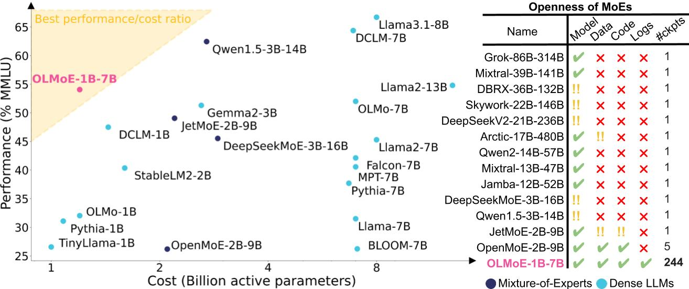

## 

This repository provides an overview of all resources for the paper "OLMoE: ...".



### Artifacts

- Pretraining checkpoints: https://hf.co/OLMoE/OLMoE-1B-7B-0824
- Pretraining data: https://hf.co/OLMoE/Dolma-OLMoE
- Pretraining logs: https://hf.co/OLMoE/Dolma-OLMoE
- Pretraining code: https://github.com/allenai/OLMo/tree/Muennighoff/MoE
- Finetuning checkpoints: https://hf.co/OLMoE/OLMoE-1B-7B-0824-IT
- Finetuning data: https://hf.co/OLMoE/Tulu-OLMoE
- Finetuning code: https://github.com/allenai/open-instruct/tree/olmoe-sft
- Finetuning logs:

### Inference

To use the model, simply run

```python
from transformers import OlmoeForCausalLM, AutoTokenizer
import torch

DEVICE = "cuda" if torch.cuda.is_available() else "cpu"

# Load different ckpts via passing e.g. `revision=step10000-tokens41B`
model = OlmoeForCausalLM.from_pretrained("OLMoE/OLMoE-1B-7B-0824").to(DEVICE)
tokenizer = AutoTokenizer.from_pretrained("OLMoE/OLMoE-1B-7B-0824")
inputs = tokenizer("Bitcoin is", return_tensors="pt")
inputs = {k: v.to(DEVICE) for k, v in inputs.items()}
out = model.generate(**inputs, max_length=64)
print(tokenizer.decode(out[0]))
# > # Bitcoin is a digital currency that is created and held electronically. No one controls it. Bitcoins aren’t printed, like dollars or euros – they’re produced by people and businesses running computers all around the world, using software that solves mathematical
```

You can list all revisions/branches via:
```python
from huggingface_hub import list_repo_refs
out = list_repo_refs("OLMoE/OLMoE-1B-7B-0824")
branches = [b.name for b in out.branches]
```

### Pretraining

1. Clone this [OLMo branch](https://github.com/allenai/OLMo/tree/Muennighoff/MoE) & create an environment with its dependencies via `cd OLMo; pip install -e .`. If you want to use new features in OLMo clone from the `main` branch instead.
2. Run `pip install git+https://github.com/Muennighoff/megablocks.git@olmoe`
3. Setup a config file. `configs/OLMoE-1B-7B-0824.yml` was used for the pretraining of `OLMoE-1B-7B-0824`. You can find configs from various ablations in `configs/ablations`.
4. Download the data from TODO & adapt the paths in your config file as needed
5. Submit your job. We used `bash scripts/olmoe-gantry.sh` which invokes https://github.com/allenai/OLMo/blob/Muennighoff/MoE/scripts/train.py and uses [beaker gantry](https://github.com/allenai/beaker-gantry) but you will likely need to change the script to work with your setup.

### Adaptation

1. Clone this [open-instruct branch](https://github.com/allenai/open-instruct/tree/olmoe-sft) & follow its setup instructions. If you want to use new features in open-instruct clone from the `main` branch instead.
2. SFT: Run `scripts/TODO-SFT-SCRIPT`.
3. DPO: Run `scripts/TODO-DPO-SCRIPT`.

### Evaluation

#### During pretraining

Evaluation during pretraining is done automatically and configured in the config file. It uses the code here: https://github.com/allenai/OLMo/tree/Muennighoff/MoE/olmo/eval.

#### After pretraining

OLMES Evals: Follow the instructions at https://github.com/allenai/OLMo-Eval/blob/51c5ba579e75ef4ce7e9b29936eaa72c1a0e99eb/olmo_eval/tasks/olmes_v0_1/README.md

DCLM Evals: Run `scripts/run_dclm_evals*` and refer to instructions from https://github.com/mlfoundations/dclm

#### After adaptation

Follow the instructions at https://github.com/allenai/open-instruct/tree/olmoe-sft.

### Visuals

The code for all plots is at `scripts/plots.ipynb` equivalent to [this colab](https://colab.research.google.com/drive/15PTwmoxcbrwWKG6ErY44hlJlLLKAj7Hx?usp=sharing).

For Figure 1, we import the plot from the colab into this drawing to edit it further: https://docs.google.com/drawings/d/1rnOnSOwrzAV7xv8lzKMJ7VPF1W-_t6_6EBD_06j66yQ/edit?usp=sharing

### Citation

```bibtex
TODO
```